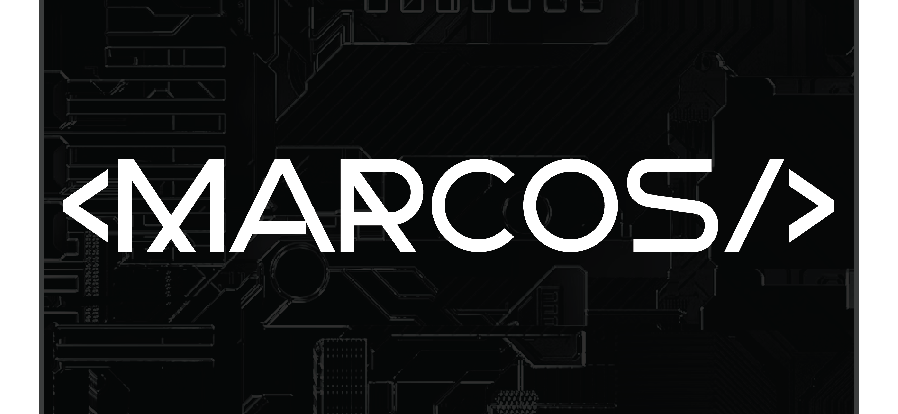
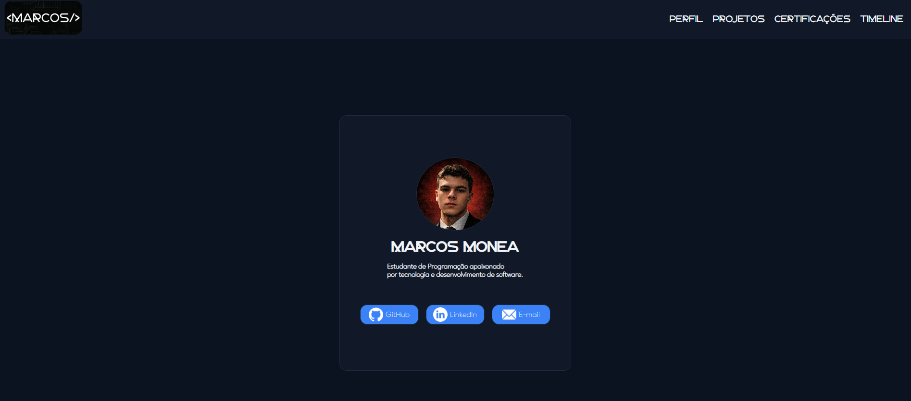
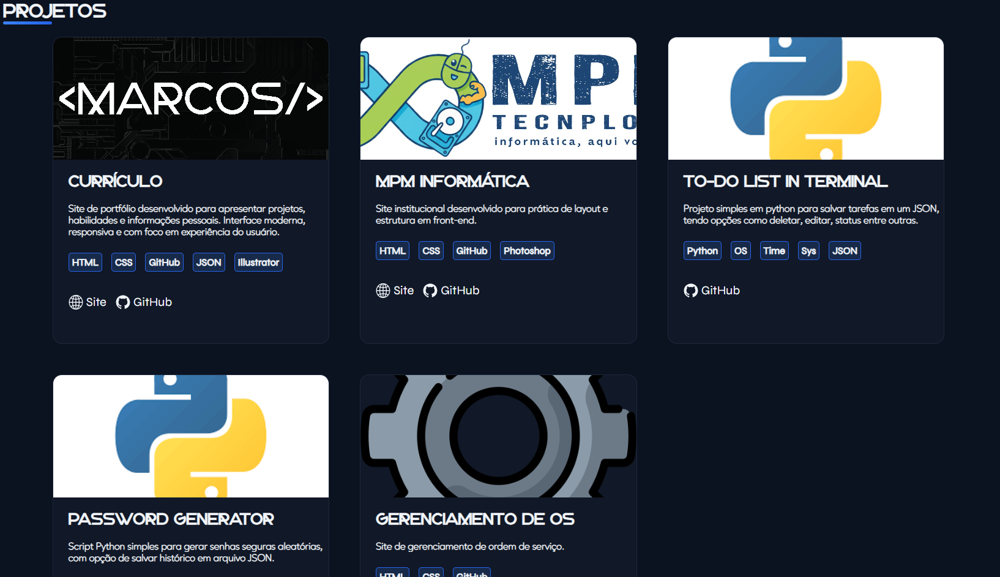
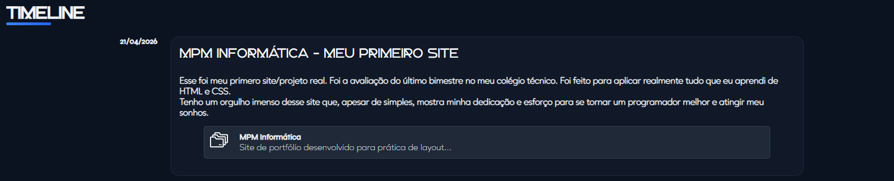
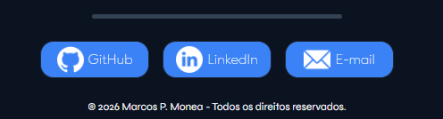

# 💎 Marcos Pereira Monea - Portfólio
### Portfólio pessoal desenvolvido com HTML5 e CSS3 para apresentar meus projetos, certificados e evolução. Este portfólio foi desenvolvido com foco em praticar HTML e CSS puro, sem uso de frameworks, priorizando responsividade, organização de código e boas práticas de layout.


# 💠 Preview






# 💠 Links
- GitHub: 
- Demo: 


# 💠 Tecnologias Usadas
- HTML5
- CSS3
- Animações
- Grid
- Illustrator


# 💠 Estrutura do Projeto

```
/portfolio
│
├── index.html
├── README.md
├── LICENSE
├── .gitattributes
│
├── /src
│   ├── /fonts
│   │   ├── Ageo.woff
│   │   ├── Ageo.woff2
│   │   ├── Gunken.woff
│   │   ├── Gunken.woff2
│   │   ├── Syne.woff
│   │   └── Syne.woff2
│   │
│   ├── /ico
│   │   ├── email.png
│   │   ├── folder.png
│   │   ├── github.png
│   │   ├── github.svg
│   │   ├── linkedin.png
│   │   ├── site.png
│   │   └── site.svg
│   │
│   ├── /img
│   │   ├── footer.png
│   │   ├── perfil.png
│   │   ├── picture.png
│   │   ├── projetos.png
│   │   └── timeline.png
│   │
│   ├── /logo
│   │   ├── /logo_q
│   │   ├── /logo_r
│   │   └── favicon.ico
│   │
│   ├── /projetos
│   │   ├── mpm.png
│   │   ├── os.png
│   │   └── python.png
│   │
│   └── /theme
│       └── pallete.json
│
└── /style
    └── index.css
```

# 💠 Como rodar

### Basta abrir o arquivo ```index.html``` no seu navegador ou acessar a demo.


# 💠  Funcionalidades

- Seção sobre mim
- Projetos
- Certificações
- Timeline para atualização de projetos
- Contato

# 💠 Autor

- Marcos P. Monea
- E-mail: marcos.monea@yahoo.com
- GitHub: 
- Linkedin: 

# 💠 Licença

This project is open-source and licensed under the MIT License, which allows anyone to use, copy, modify, and distribute this software.
See the full license in the [LICENSE](LICENSE) file.